<!--
author:   Mark Jacob, Marika Claus, Sebastian Zug
email:    your@email.com
version:  0.1.0
language: en
narrator: US English Female

comment:  A pitch for a Digital Fellows transfer project

import: https://raw.githubusercontent.com/liaScript/mermaid_template/master/README.md

link:     https://cdn.jsdelivr.net/chartist.js/latest/chartist.min.css

script:   https://cdn.jsdelivr.net/chartist.js/latest/chartist.min.js

-->

# DF Transfer Pitch

    {{0}}

    {{1-2}}

```mermaid @mermaid
flowchart LR
    A[Tandem Fellowship Freiberg ⭐⭐⭐⭐⭐]
    A-->B(Studis in Freiberg 😃😊😄)
    A-->C(Transfer-Partner Mittweida 🧑‍🏫👩‍🏫👨‍🏫)
    C-->D(Studis in Mittweida 😄😊😃)
```

    {{2-3}}

```mermaid @mermaid
flowchart LR
    A[Tandem Fellowship in Freiberg ⭐⭐⭐⭐⭐]
    A-->B(Studis in Freiberg 😃😊😄)
    B-->A
    A-->C(Transfer-Partner Mittweida 🧑‍🏫👩‍🏫👨‍🏫)
    C-->D(Studis in Mittweida 😄😊😃)
    C-->A
    D-->C
    D-->B
    B-->D
```

    {{3}}
> **Konzept:** Lehr- / Lernkompetenz für die Vermittlung von fremdsprachlichen Präsentationstechniken auf der Basis von interaktiven OER Materialien

## Was wurde bisher umgesetzt?

    {{0}}
> In der LV des Transfer-Gebers: **Einführung in die Fachsprache: Englisch für Mathematik und Informatik** mit insgesamt **20 Studierenden** der Studiengänge **Angewandte Informatik**, **Robotik** und **Angewandte Mathematik** haben die Studierende Fachvortäge vorbereitet und gehalten.

    {{1}}

```mermaid @mermaid
flowchart LR
    A[1. Technische Beschreibung]
    A-->B(2. Präsentationstechniken)
    B-->C(3. Digital technology)
    C-->D(4. Fachvorträge auf Englisch)
```

    {{2}}

```mermaid @mermaid
flowchart LR
    A[1. Image describer Tool mit Textanalyse und Peer-Review]
    A-->B(2. Self-study Videos)
    B-->C(3. LiaScript Training)
    C-->D(4. Fachvorträge auf Englisch)
```

### Image description mit peer-review

### Self-study Präsentationstechniken

!?[alt-text](https://video.tu-freiberg.de/video/IEP-1-Introducing-yourself/4349372d9d69e2415729b1a3a2fab941 "Introducing yourself")
!?[alt-text](https://video.tu-freiberg.de/video/IEP-2-Introducing-your-topic/5978d19af08232dfa88c03cb7ad2a14f "Introducing your topic")
!?[alt-text](https://video.tu-freiberg.de/video/IEP-3-Synonyms/c2230053b26249e624c2476f8c7a409a "Synonyms")

!?[alt-text](https://video.tu-freiberg.de/video/IEP-4-Useful-phrases/3bebb19a2d1f9c8fa2a6c4d338134561 "Useful Phrases")
!?[alt-text](https://video.tu-freiberg.de/video/IEP-5-Nerves/89bf38bd9dc6eb725746648b05e67c75 "Nerves")
!?[alt-text](https://video.tu-freiberg.de/video/IEP-6-Non2Dverbal-communication-p1/d5b08cd5a5b7ffcd076acfcf29fa1b30 "Non-verbal communication 1")

!?[alt-text](https://video.tu-freiberg.de/video/IEP-6-Non2Dverbal-communication-p2/892ed954c1bb2fc53f5a6efaf97f0e4f "Non-verbal communication 2")
!?[alt-text](https://video.tu-freiberg.de/video/IEP-7-Conclusion/04a93eca656810677743ff2488fda44b "Conclusion")
!?[alt-text](https://video.tu-freiberg.de/video/IEP-8-Questions/e87b984068e6be6ac2d41d9941e133dd "Questions")

### Fachvorträge auf Englisch

??[Student presentation](https://liascript.github.io/course/?https://raw.githubusercontent.com/BerndSchmecka/lia-presentation/main/presentation.md#5)

### Konzept part 2

> didaktisches Szenario

> Kurzbeschreibung

- the teachers’ actions
- the expected reactions of the students
- the justification of the teachers’ didactical choices
- eingesetzte digitale Medienformate
- (8) (PDF) Didactic Scenarios and ICT: A Good Practice Guide. Available from: https://www.researchgate.net/publication/227264265_Didactic_Scenarios_and_ICT_A_Good_Practice_Guide [accessed Feb 04 2024].

## Lehrveranstaltung

> In welchen Lehrveranstaltungen wird das Konzept im Rahmen des Transfer-Fellowships eingebunden?

- ***Name der LV der/des Transfer-Geber:in:*** Einführung in die Fachsprache: Englisch für Mathematik und Informatik (English for Specific Purposes for Mathematics and Computer Science)

- ***Studiengang:*** Bachelor Angewandte Informatik, Diplom Robotik, Diplom Angewandte Mathematik

- ***Anzahl Studierende:*** Insgesamt 20 Studierende

- ***Name der LV der/des Transfer-Empfänger:in:***

- ***Studiengang:***

- ***Anzahl Studierende:***

## Zielstellungen

> Welche Zielstellungen verfolgt der Transfer? Welche Ergebnisse stehen am Ende des Transfer-Fellowships zur Verfügung?
>
> Was wird nach dem Transfer-Fellowship anders sein?

- Close cooperation between the Language Centres of HS Mittweida and TUBAF. More opportunities for the students in Mittweida. 

> Woran werden Sie die Zielerreichung messen können? (!)

 - Material for students

  - Videos integrated into the instructions
  - Instructions for students (using LiaScript)
  - Questionnaires for students (to be completed before and after implementation)

 - Material for staff

  - Online course for teachers (Instructions for transfer receivers)
  - Checklist for teachers (To be prepared for implementation)
  - Questionnaires for teachers (to be completed before and after implementation)

## Transferaktivitäten

> Wie wird der Transfer gestaltet? Welche Transferaktivitäten planen Sie?

- Welche Dinge müssen im Rahmen des Transfers angepasst werden (z. B. (fach-)didaktische Elemente, Inhaltsproduktion organisatorische Aspekte, …)
- Welche Maßnahmen zur Umsetzung sind geplant? (!)
- Wie tauschen sich die Transfer-Partner:innen aus?

## Finanzen

> Wie beabsichtigen Sie die bereitgestellten finanziellen Mittel zu verwenden (z. B. für Personalausgaben, Sachkosten, Reisekosten, Publikationsgebühren usw.)? Bitte präzisieren Sie, wie die finanziellen Ressourcen für jede:n der beiden Partner:innen kalkuliert werden.

- Wofür benötigen Sie die finanziellen Mittel (z. B. Personalausgaben, Sachausgaben, Reisemittel, Publikationsgebühren, …)?
- Bitte geben Sie genau an, wie hoch die finanziellen Ressourcen für jede:n der beiden Partner:innen kalkuliert werden. (!)

### Mittweida

### Freiberg

## Mehrwert

> Welchen Mehrwert haben die Transferaktivitäten für die beiden beteiligten Partner:innen und deren Studierende?

- Mehrwert und Motivation für den/die Transfer-Geber:in
- Mehrwert und Motivation für den/die Transfer-Empfänger:in
- Vorteile für die Studierenden in den jeweiligen LV

## Vorbild

> Wie können Sie mit Ihrem Transfer-Fellowship als Vorbild für die sächsische Hochschullandschaft wirken? Welche Maßnahmen ergreifen Sie hierfür?

- Warum ist Ihre Idee/Ihr Konzept auch für andere Lehrende in Sachsen interessant? Wie erfahren diese davon?
- Was geschieht nach Abschluss des Vorhabens mit den Ergebnissen? Wie sorgen Sie dafür, dass die Ergebnisse nach Ende des Fellowships weiter genutzt werden?

- We will identify other language centres that would be willing to try out our stuff and contact them

- Wir werden Ängste von Anderen überwinden (Help others to overcome their anxieties about digital and online - that HS Mittweida will make one big language centre with TUBAF if we cooperate on a course which involves digital elements)
