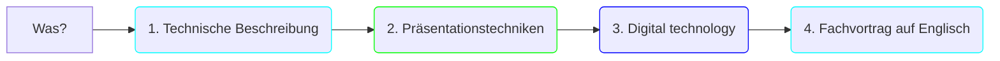
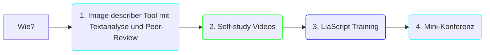
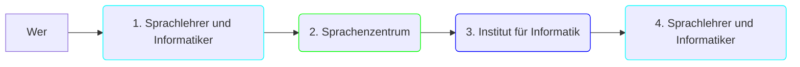
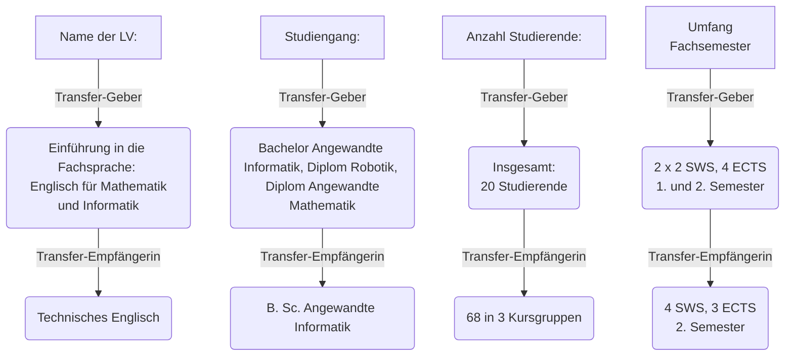

<!--
author:   Mark Jacob, Marika Claus, Sebastian Zug
email:    Mark.Jacob@iuz.tu-freiberg.de
version:  0.1.0
language: de
narrator: US English Female

comment:  A pitch for a Digital Fellows transfer project

import: https://raw.githubusercontent.com/liaScript/mermaid_template/master/README.md

link:     https://cdn.jsdelivr.net/chartist.js/latest/chartist.min.css

script:   https://cdn.jsdelivr.net/chartist.js/latest/chartist.min.js

-->

# DF Transfer Pitch

    {{0}}

    {{1}}
> **Konzept:** Lehr- / Lernkompetenz für die Vermittlung von fremdsprachlichen Präsentationstechniken auf der Basis von interaktiven OER Materialien

## Was wurde bisher umgesetzt?

    {{0-4}}
> In der LV des Transfer-Gebers: **Einführung in die Fachsprache: Englisch für Mathematik und Informatik** mit insgesamt **20 Studierenden** der Studiengänge **Angewandte Informatik**, **Robotik** und **Angewandte Mathematik** haben die Studierende Fachvortäge vorbereitet und gehalten.

    {{1-4}}

    {{2-4}}

    {{3-4}}

    {{4}}
??[Student presentation](https://liascript.github.io/course/?https://raw.githubusercontent.com/BerndSchmecka/lia-presentation/main/presentation.md#5)

## In welchen Lehrveranstaltungen wird das Konzept eingebunden?

## Welche Zielstellungen verfolgt der Transfer?

1. Verbesserung des **Lernerfolgs/-effekts** im Fachenglischkurs (HSMW)
2. Bessere **Vernetzung** zwischen den Sprachenzentren der HSMW und TUBAF
3. Stärkung der **Nachhaltigkeit** des Digital-Fellowship-Projekts „Lehr- / Lernkonzept für die Vermittlung von fremdsprachlichen Präsentationstechniken auf der Basis von interaktiven OER Materialien“

## Woran werden Sie die Zielerreichung messen können?

- Dokumentation (LiaScript, Blogs u.a.)
- Befragungen/Interviews
- Umfragen
- Studierendenergebnisse im Rahmen des Transferziels (Videos, Webseiten etc.)

## Welche Maßnahmen zur Umsetzung sind geplant?

1. Planung der Kursanpassung bei der Transfer-nehmenden Institution
2. Bedarfsklärung bei der Transfer-Zielgruppe
3. Austausche zw. HSMW und TUBAF
4. gemeinsame Materialiensammlung anlegen

## Wie hoch werden die finanziellen Ressourcen für jede:n der beiden Partner:innen kalkuliert?

| Kosten                | Freiberg   | Mittweida | Summe          |
| --------------------- | ---------- | :-------: | -------------: |
|  Personal             | €5.536,26  | €5.536,26 | €11.172,52     |
|  Reisemittel          | €500       | €500      | €1.000         |
|  Sachmittel           | €700       | €700      | €1.400         |
|  Konferenzbesuch      | €600       | €600      | €1.200         |
|  Summe                | €7.336,26  | €7.336,26 | **€14,772,52** |

## Welchen Mehrwert haben die Transferaktivitäten für die beiden beteiligten Partner:innen und deren Studierende?

## Wie können Sie mit Ihrem Transfer Fellowship als Vorbild für die sächsische Hochschullandschaft wirken?

