<!--
author:   Mark Jacob, Marika Claus, Sebastian Zug
email:    your@email.com
version:  0.1.0
language: de
narrator: US English Female

comment:  A pitch for a Digital Fellows transfer project

import: https://raw.githubusercontent.com/liaScript/mermaid_template/master/README.md

link:     https://cdn.jsdelivr.net/chartist.js/latest/chartist.min.css

script:   https://cdn.jsdelivr.net/chartist.js/latest/chartist.min.js

-->

# DF Transfer Pitch

    {{0}}

    {{1}}
> **Konzept:** Lehr- / Lernkompetenz für die Vermittlung von fremdsprachlichen Präsentationstechniken auf der Basis von interaktiven OER Materialien

## Was wurde bisher umgesetzt?

    {{0-4}}
> In der LV des Transfer-Gebers: **Einführung in die Fachsprache: Englisch für Mathematik und Informatik** mit insgesamt **20 Studierenden** der Studiengänge **Angewandte Informatik**, **Robotik** und **Angewandte Mathematik** haben die Studierende Fachvortäge vorbereitet und gehalten.

    {{1-4}}

```mermaid @mermaid
flowchart LR
    Was?-->A
    classDef cyan stroke:#0ff
    classDef green stroke:#0f0
    classDef blue stroke:#00f
    A(1. Technische Beschreibung)
    A:::cyan-->B(2. Präsentationstechniken)
    B:::green-->C(3. Digital technology)
    C:::blue-->D(4. Fachvortrag auf Englisch)
    D:::cyan
```

    {{2-4}}

    {{3-4}}

```mermaid @mermaid
flowchart LR
    Wer-->A
    classDef cyan stroke:#0ff
    classDef green stroke:#0f0
    classDef blue stroke:#00f
    A(1. Sprachlehrer und Informatiker)
    A:::cyan -->B(2. Sprachenzentrum)
    B:::green-->C(3. Institut für Informatik)
    C:::blue-->D(4. Sprachlehrer und Informatiker)
    D:::cyan
```

    {{4}}
??[Student presentation](https://liascript.github.io/course/?https://raw.githubusercontent.com/BerndSchmecka/lia-presentation/main/presentation.md#5)

## In welchen Lehrveranstaltungen wird das Konzept eingebunden?

```mermaid @mermaid
flowchart TB
    A[Name der LV:]
    A-->|Transfer-Geber| B(Einführung in die Fachsprache: <br> Englisch für Mathematik und Informatik)
    C[Studiengang:]
    C-->|Transfer-Geber| D(Bachelor Angewandte Informatik, Diplom Robotik, <br> Diplom Angewandte Mathematik)
    E[Anzahl Studierende:]
    E-->|Transfer-Geber| F(Insgesamt: <br> 20 Studierende)
    B-->|Transfer-Empfängerin| G(Insert name here)
    D-->|Transfer-Empfängerin| H(Insert subject here)
    F-->|Transfer-Empfängerin| I(Insert number here)
```

## Woran werden Sie die Zielerreichung messen können?

 - Material for students

  - Videos integrated into the instructions
  - Instructions for students (using LiaScript)
  - Questionnaires for students (to be completed before and after implementation)

 - Material for staff

  - Online course for teachers (Instructions for transfer receivers)
  - Checklist for teachers (To be prepared for implementation)
  - Questionnaires for teachers (to be completed before and after implementation)

## Welche Maßnahmen zur Umsetzung sind geplant?

## Wie hoch werden die finanziellen Ressourcen für jede:n der beiden Partner:innen kalkuliert?

> Mittweida

> Freiberg: €7500
- Personalausgaben: 2 x SHK €5400
- Reisemittel: FG - MW €150
- Workshop: €1000
- Wettbewerb: €500
- Publikationsgebühren: €350